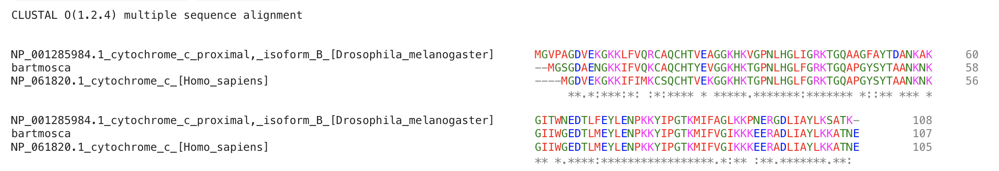
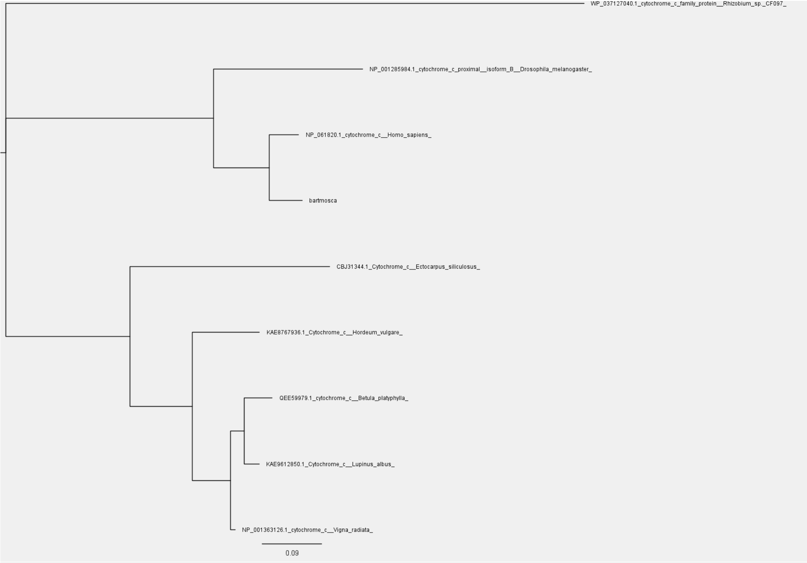

1. Detalla las tácticas y/o metodologías que deberían utilizarse para darles una respuesta a los padres del niño. Dadas las secuencias de Mosca, humano y Moscahumano ¿Qué criterios se les ocurren para comparar las secuencias? ¿Qué resultados obtienen del análisis anterior? ¿Qué resultado esperaría obtener si utilizara el resto de las secuencias en el análisis? ¿Por qué?

    Se puede hacer alineamiento de secuencias de alguna proteina que tengamos secuenciada en las tres especies para ver si se conservan similitudes entre los organismos. 
    Podriamos usar los score de alineamiento para decidir con cual de las especies existe mayor similitud. Si agregamos mas secuencias aumentamos la cantidad de informacion con la que contamos para comparar,
    con lo cual ganariamos exactitud.

2. Como vimos anteriormente existen algunos softwares optimizados para confeccionar alineamientos de secuencias. En particular hemos trabajado con Clustal (Larkin et al. 2007). Confecciona el alineamiento para el punto I.

3. Mediante el uso del servidor de IQtree (Trifinopoulos et al. 2016), confecciona los árboles filogenéticos para los alineamientos obtenidos en el punto II. Como vemos, el servidor nos permite elegir el modelo de sustitución ¿A qué se refiere? ¿Qué es el Bootstrap? ¿De qué manera nos habla de la calidad de nuestro árbol? ¿Cómo influye el número de Bootstraps en el resultado? Interpreten los resultados obtenidos, mediante la visualización de los árboles con la herramienta FigTree. ¿Es necesario realizar algún paso extra, previo a la interpretación del árbol? ¿Por qué?

El modelo de sustitucion se refiere al metodo de comparacion de las secuencias, lo que permite armar distintos arboles filogeneticos. El bootstrap es el metodo con el que confirmamos cuan buenos son los arboles generados, nos indica la calidad de nuestro arbol mediante la comparacion del arbol generado con otros arboles generados en base a alineamientos modificados.La calidad del arbol deberia incrementarse al incrementar los bootstraps porque el arbol se compararia con mayor cantidad de arboles modificados.
Con el arbol generado se puede dar una respuesta y decir que Bart Mosca conserva mas caracteristicas geneticas de Humano que de mosca.

